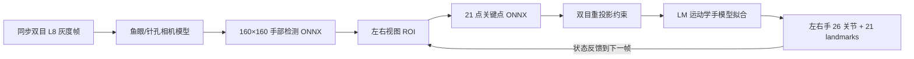

# Mercury Handpose

Mercury Handpose 是从 [Monado](https://gitlab.freedesktop.org/monado/monado) 独立出来的 C++20 双目手部姿态追踪库。它面向一对已标定、时间同步的灰度相机，尤其适合头戴设备上的双目鱼眼相机：输入左右两幅原始图像，输出左手和右手的米制 3D 骨骼。

这个仓库只保留 Mercury 推理与运动学拟合所需的最小代码，不依赖 Monado 服务、OpenXR runtime、设备驱动或 IPC。公开头文件也不暴露 OpenCV 和 XRT 类型，便于嵌入采集、机器人或 VLA 数据流水线。

## 工作流程



检测网络负责找到手部区域；关键点网络在两个相机视图中预测关节观测；Mercury 再结合双目标定、深度线索和时序状态，用 Levenberg–Marquardt 运动学优化恢复一致的 3D 手骨架。

## 输入与输出

### 输入约束

每次 `Tracker::process` 接收一对 `mercury::GrayImageView`：

- 8-bit 单通道灰度，像素格式为 L8；
- 左右输入图宽高相同，并与标定分辨率保持相同宽高比；当前 Mercury 也要求两台相机使用同一种畸变模型和同一标定分辨率；
- 输入是与标定相匹配的原始畸变图像，不要先做双目矫正或裁剪；
- 两帧必须对应同一采集时刻。时间戳单位是纳秒，必须非负，实际流中应单调递增；
- `stride_bytes` 可以大于图像宽度，图像内存在行填充也可；底层缓冲区至少在 `process` 返回前保持有效。

相机旋转了 90°/180°/270° 或鱼眼有效区域是圆形时，可通过 `TrackerOptions::camera_orientations` 和 `image_boundaries` 配置。

### 输出内容

`FrameResult` 同时包含 `left` 与 `right` 两个 `HandPose`。每只手提供：

- `active`：该帧是否追踪到这只手；
- `joints[26]`：OpenXR 风格的 26 关节位置、方向四元数、半径和有效/追踪标志；
- `landmarks_21`：更轻量的 21 点位置，顺序为腕部、拇指 4 点、食指 4 点、中指 4 点、无名指 4 点、小指 4 点；
- `is_right`：手性标识。

26 关节的确切枚举顺序以 [`mercury::Joint`](include/mercury/hand_tracker.hpp) 为准；它比 21 点格式多出掌心和四指的 metacarpal 关节。输出距离、关节半径均使用米。

### 坐标系

输出 3D 姿态以左相机光心为原点，采用 Mercury/OpenXR 相机坐标方向：

- `+X`：图像右方；
- `+Y`：上方；
- `-Z`：相机朝前的观察方向；
- 位置和半径单位：米。

标定 JSON 则遵循 OpenCV 相机坐标（`+X` 向右、`+Y` 向下、`+Z` 向前），外参满足：

```text
point_right = rotation * point_left + translation
```

库会在内部完成 OpenCV 到 Mercury 坐标方向的转换。不要在传入标定前自行翻转 Y/Z 轴。

## 依赖

- 支持 C++20 的 Clang 或 GCC；
- CMake 3.22+；
- Ninja（预设使用 Ninja，也可自行选择生成器）；
- Eigen 3.3+；
- OpenCV `core`、`imgproc`；构建示例时还需 `highgui`、`videoio`、`imgcodecs`；
- ONNX Runtime 的 C/C++ headers 与共享库；
- Git LFS（仅下载模型时需要）。

推理当前通过 ONNX Runtime CPU session 运行。

## 获取模型

源码仓库不包含权重。下面的脚本会固定到已审计的上游提交，只拉取 Mercury 需要的两个 ONNX 文件并校验 SHA-256：

```bash
git lfs install
./scripts/fetch_models.sh
```

重要：模型上游没有显式许可证。脚本不会改变这一事实；使用或再分发前请阅读 [`models/README.md`](models/README.md) 并自行确认授权。

## 构建

### macOS（Homebrew）

```bash
brew install cmake ninja eigen opencv onnxruntime git-lfs
git lfs install
./scripts/fetch_models.sh

cmake --preset release -DMERCURY_MODELS_DIR="$PWD/models"
cmake --build --preset release
ctest --preset release
```

`FindONNXRuntime.cmake` 已包含 Apple Silicon 和 Intel Homebrew 的常见路径。如果仍未找到，可显式指定：

```bash
cmake --preset release \
  -DONNXRUNTIME_ROOT="$(brew --prefix onnxruntime)" \
  -DMERCURY_MODELS_DIR="$PWD/models"
```

### Linux（Debian/Ubuntu 示例）

```bash
sudo apt update
sudo apt install build-essential cmake ninja-build git git-lfs \
  libeigen3-dev libopencv-dev
git lfs install
```

再安装 ONNX Runtime 的 C/C++ 开发包或官方预编译包，并让 `ONNXRUNTIME_ROOT` 指向同时含有 `include/` 和 `lib/` 的根目录：

```bash
export ONNXRUNTIME_ROOT=/absolute/path/to/onnxruntime
./scripts/fetch_models.sh

cmake --preset release -DMERCURY_MODELS_DIR="$PWD/models"
cmake --build --preset release
ctest --preset release
```

不需要带模型的冒烟测试时，可省略 `MERCURY_MODELS_DIR`。也可关闭附加目标：

```bash
cmake -S . -B build/minimal -G Ninja \
  -DCMAKE_BUILD_TYPE=Release \
  -DMERCURY_BUILD_EXAMPLES=OFF \
  -DMERCURY_BUILD_TESTS=OFF
cmake --build build/minimal
```

## C++ API 示例

```cpp
#include <mercury/hand_tracker.hpp>

#include <chrono>
#include <cstdint>
#include <vector>

int main()
{
    const auto calibration =
        mercury::load_calibration_json("config/calibration.json");

    mercury::TrackerOptions options;
    options.warmup_frames = 10;
    options.minimum_detection_confidence = 0.3f;
    mercury::Tracker tracker(calibration, "models", options);

    const std::uint32_t width = 640;
    const std::uint32_t height = 480;
    std::vector<std::uint8_t> left_pixels(width * height);
    std::vector<std::uint8_t> right_pixels(width * height);
    // 此处填入同一时刻采集的左右灰度帧。

    const auto elapsed = std::chrono::steady_clock::now().time_since_epoch();
    const auto timestamp_ns =
        std::chrono::duration_cast<std::chrono::nanoseconds>(elapsed).count();

    const mercury::GrayImageView left{
        left_pixels.data(), width, height, width};
    const mercury::GrayImageView right{
        right_pixels.data(), width, height, width};

    const mercury::FrameResult result =
        tracker.process(left, right, timestamp_ns);
    if (result.right.active) {
        const auto &tip =
            result.right.joints[static_cast<std::size_t>(mercury::Joint::IndexTip)];
        // tip.position 是左相机坐标系下的米制位置。
    }
}
```

CMake 项目直接作为子目录使用时链接 `Mercury::handpose`：

```cmake
add_subdirectory(path/to/Mercury-handpose)
target_link_libraries(your_target PRIVATE Mercury::handpose)
```

`Tracker` 有内部状态且不可复制；移动是允许的。多个线程调用同一个实例时会在内部串行执行，但相邻帧仍应按时间顺序提交。

## `mercury_stereo_demo`

示例支持两路独立的 OpenCV 视频/相机源，或一条左右拼接（side-by-side）的源。`SOURCE` 可以是视频路径，也可以是纯数字的 OpenCV 相机索引。

两路视频：

```bash
./build/release/mercury_stereo_demo \
  --calibration config/calibration.json \
  --models models \
  --left left.mp4 \
  --right right.mp4 \
  --output poses.ndjson \
  --show
```

左右拼接视频（左半幅是左相机，右半幅是右相机）：

```bash
./build/release/mercury_stereo_demo \
  --calibration config/calibration.json \
  --models models \
  --sbs stereo-sbs.mp4 \
  --max-frames 500 \
  --show
```

两台相机：

```bash
./build/release/mercury_stereo_demo \
  --calibration config/calibration.json \
  --models models \
  --left 0 --right 1 --show
```

若不指定 `--output`，每帧 NDJSON 会写到标准输出。示例的 NDJSON 只输出两只手的 `active` 和 21 个三维点；完整 26 关节、方向和有效标志请使用库 API。显示窗口中按 `Esc` 或 `q` 退出。

注意：示例对两个独立 `VideoCapture` 依次读帧，不能提供硬件级同步。正式采集应由相机驱动按曝光时间配对，再将同一对帧交给 `Tracker::process`；SBS 文件通常更容易保持帧级对应。

## 标定 JSON

[`config/calibration.example.json`](config/calibration.example.json) 给出了可直接复制修改的 Monado JSON v2 格式。关键约束如下：

- `metadata.version` 为 `2`；
- `cameras` 必须恰好有两个元素，顺序是左、右；
- 两相机必须使用相同 `model`：
  - `fisheye_equidistant4`：`k1`、`k2`、`k3`、`k4`，对应 OpenCV fisheye/KB4；
  - `pinhole_radtan5`：`k1`、`k2`、`p1`、`p2`、`k3`；
- `intrinsics` 是 `fx`、`fy`、`cx`、`cy`，单位为像素；
- 两台相机的 `resolution` 必须一致；送入追踪器的图像可以等比例缩放，但不可裁剪或改变宽高比；
- `opencv_stereo_calibrate.rotation` 是行主序 3×3 数组，`translation` 是 3 元数组且单位必须换算为米；
- `essential`、`fundamental` 和相机 `name` 可保留用于记录，但当前加载器不会使用它们。

最小结构：

```json
{
  "metadata": {"version": 2},
  "cameras": [
    {
      "model": "fisheye_equidistant4",
      "intrinsics": {"fx": 300, "fy": 300, "cx": 320, "cy": 240},
      "distortion": {"k1": 0, "k2": 0, "k3": 0, "k4": 0},
      "resolution": {"width": 640, "height": 480}
    },
    {
      "model": "fisheye_equidistant4",
      "intrinsics": {"fx": 300, "fy": 300, "cx": 320, "cy": 240},
      "distortion": {"k1": 0, "k2": 0, "k3": 0, "k4": 0},
      "resolution": {"width": 640, "height": 480}
    }
  ],
  "opencv_stereo_calibrate": {
    "rotation": [1, 0, 0, 0, 1, 0, 0, 0, 1],
    "translation": [-0.064, 0, 0]
  }
}
```

示例数值只是格式说明，不是可用于真实设备的通用标定。特别要检查标定工具输出的平移单位；许多棋盘标定流程会沿用毫米，必须除以 1000 后再写入本项目。

## 当前限制

- 只接受同步的双目灰度输入，不支持单目模式、异步帧配对或彩色图像 API；
- 两台相机目前必须同分辨率、同畸变模型；
- 支持 KB4 鱼眼和 OpenCV RadTan5，不支持其他相机模型；
- 默认前 10 帧用于 warm-up，期间手可能保持 inactive；快速运动、遮挡、强模糊、过曝或双目共同视野外会降低稳定性；
- 公共 API 暂不返回检测置信度或逐关节置信度，只提供 active 及关节有效/追踪标志；
- 当前没有通用的精度承诺。实际效果强依赖相机同步、标定误差、基线、视场和输入质量，应使用目标设备数据做定量回归；
- 上游模型权重没有显式许可，不能把源码许可证理解为模型授权。

## 来源与许可

源码提取自 Monado 提交 `2f194e366fbcc54272a755dc0e6ada7995b11719`。详细目录映射和升级方式见 [`UPSTREAM.md`](UPSTREAM.md)，第三方归属见 [`THIRD_PARTY_NOTICES.md`](THIRD_PARTY_NOTICES.md)。本项目保留上游文件的版权声明与许可证；仓库自身以根目录 [`LICENSE`](LICENSE) 所示的 Boost Software License 1.0 发布。
